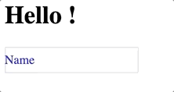

[](https://www.npmjs.com/package/svelte-inputs)
[](https://packagephobia.now.sh/result?p=svelte-inputs)


# svelte-inputs

Basic Input Components for No Muss, No Fuss Plug and Play with Svelte

## Features!

- Event Callbacks
- Data binding
- Input Masking

## Contents:

- [Installation](#Installation)
- [Usage](#Usage)
- [Masking](#Masking)
- [Styling](#Styling)
- [Development](#Development)

## Background

`svelte-inputs` was made on the idea that there should be simple, straightforward inputs, at a modular level for `Svelte`. No more fussing about!

`svelte-inputs` requires `Svelte` >= 3.0.0

# Installation

The easiest and recommended way to install `svelte-inputs` is with the `npm` command line.

```
npm i svelte-inputs
```

# Usage

At the moment, `svelte-inputs` comes with two (2) basic input modules.

All text inputs support the properties:

- value
- placeholder
- disabled
- className (see notes on styling)
- mask

All text inputs support the events:

- on:change
- on:focus
- on:blur
- on:keyup

Text Inputs are imported with the ES6 `import`, though `Babel` is also recommended.
It may also be helpful to alias imports for inputs with longer names.

**Ex:**

```js
import {
  TextInput,
  TextInputWithPlaceholder as InputPlaceholder
} from "svelte-inputs";
```

## TextInput

`TextInput` is a basic text input. It handles all of the basic properties of a regular input, but with direct bindings to the variables you provide it.


**Ex:**
**App.svelte**

```html
<script>
  import { TextInput } from "svelte-inputs";

  let myvar = "Example!";
</script>
<style>
  ...;
</style>
<TextInput value="{myvar}" />
```

This passes `myvar` to the text input for modification. However, without additional properties supplied, any modification on the variable will not be able to be retrieved.
In order to get instant updates to `myvar`, it is recommended to `bind` the `value` property to your variable.

**Ex:**

```html
<TextInput bind:value="{myvar}" />
```

Alternatively, for complex situations, you may not want the variable to be instantly updated - for example, if you needed additional processing.
In this situation, pass a callback method to the `on:change` property. The callback must be able to consume a custom `Svelte` event.

**Ex:**

```html
<script>
  import { TextInput } from "svelte-inputs";

  let myvar = "Example!";

  function myCallback(event) {
    let tmp = event.detail; //get the modified string
    myvar = tmp.trim();
  }
</script>
<style>
  ...;
</style>
<TextInput value="{myvar}" on:change="{myCallback}" />
```

## TextInputWithPlaceholder

Similar to the usage of the basic `TextInput`, it also provides a placeholder that collapses on focus/entry.

The `placeholder` property is not required, but it behaves much like a basic `TextInput` without it.



**Ex:**

```html
<script>
  import { TextInputWithPlaceholder as Input } from "svelte-inputs";

  let myvar = "Example!";
  let myplaceholder = "App Name:";
</script>
<style>
  ...;
</style>
<input bind:value="{myvar}" placeholder="{myplaceholder}" />
```

In keeping with basic `Svelte`, the `placeholder` property also supports binding.

# Masking

`svelte-inputs` comes with some basic masking.

A mask can be given to a component through the `mask` property.
This property accepts a config object in the given form below:

```js
{
  mask: "(xxx) xxx-xxxx",
  override: true,
  enforceLength: true,
  alwaysVisible: false,
  defaultChar: ' '
}
```

### Properties

- `mask`: `String`; This is the actual mask that you want to use for the input. `x` characters denote user input characters. All other characters will be included as part of the mask.
- `override`: `Boolean`; This tells the component whether or not to override the bound value property with the mask (`true`) or return only the raw characters entered by the user (`false`).
  In either case, the mask will still display.
- `enforceLength`: `Boolean`; This determines if the mask should enforce the length of the input based on the length of the mask.
- `alwaysVisible`: `Boolean`; determines if the mask should be visible at all times. If false, the mask will only appear as characters are typed. Default is `false`.
- `defaultChar`: `String`; The default character (or string) used as a placeholder for each `x` character in the mask. This only applied to a mask that is also configured to be `alwaysVisible: true`.

# Styling

Because of how `Svelte` handles scoping of styles in components, in order to override the styling of the elements in the `svelte-inputs` components,
you will need to either force style _cascading_ with the `:global` style property;
or you will need to place your styles in a global stylesheet, such as the default `global.css`
in the [sveltejs template](https://github.com/sveltejs/template) (/public/global.css).

**Example using `:global`**

```html
<script>
  import { TextInput as Input } from "svelte-inputs";

  let myvar = "Example!";
</script>
<style>
  :global(input) {
    color: blue;
  }
</style>
<input bind:value="{myvar}" />
```

### **className**

`className` is a special property that allows you to give special classes to the inputs.
Still, to use these classes will require use of one of the methods mentioned above.

# Development

If you'd like to contribute to the development of this project and extend the `svelte-inputs`
library, please join us on GitHub!
